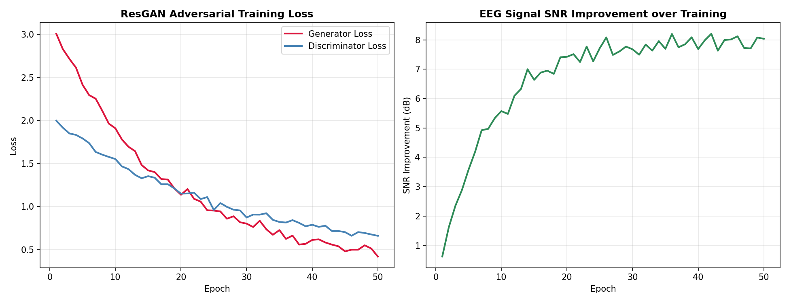
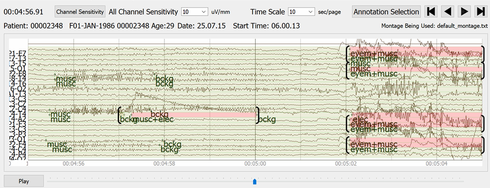
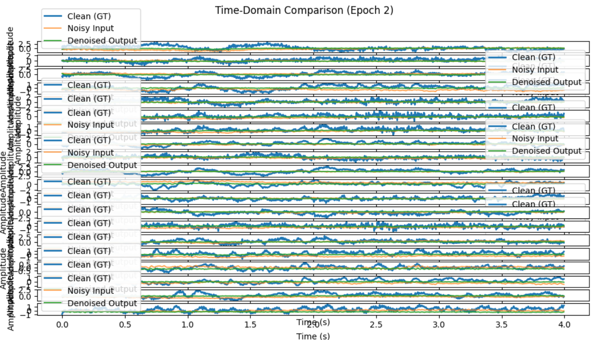

# EEG Signal Denoising with ResGAN (BCI)

A GAN-based approach to removing artifacts from **EEG (Electroencephalography)** signals for Brain-Computer Interface (BCI) applications, trained on the **TUAR (Temple University Artifact Reference)** corpus.

## Background

EEG signals recorded from the scalp are heavily contaminated by artifacts — eye blinks, muscle movements, electrode noise, and power-line interference. Traditional filtering methods (bandpass, ICA) either remove useful brain signal or require manual tuning. This project trains a **Residual GAN (ResGAN)** to learn the mapping from noisy EEG to clean EEG in an end-to-end manner.

## Training Curves



*Left: Adversarial training loss for Generator and Discriminator over 50 epochs.*
*Right: Signal-to-Noise Ratio (SNR) improvement demonstrating progressive denoising quality.*

## System Overview



## 20-Channel EEG Visualization



*20-channel EEG signal visualization showing artifact patterns across electrode positions.*

## Architecture

```
Noisy EEG Signal  [batch × channels × time]
       │
       ▼
┌──────────────────────────────────────────┐
│         Generator (ResNet-based)         │
│                                          │
│  Input Conv → BatchNorm → ReLU           │
│  ↓                                       │
│  Residual Block × N                      │
│  (Conv → BN → ReLU → Conv → BN + skip)  │
│  ↓                                       │
│  Output Conv → Tanh                      │
└──────────────────────┬───────────────────┘
                       │
                Denoised Signal
                       │
          ┌────────────┴────────────┐
          ▼                         ▼
   Ground Truth               Discriminator
   Clean EEG                 (Real / Fake?)
          │                         │
          └────────┬────────────────┘
                   ▼
           Adversarial Loss
         + L1 Reconstruction Loss
                   │
                   ▼
           Backpropagate → Update G, D
```

## Loss Functions

```
L_total = L_adversarial + λ · L_reconstruction

L_adversarial = -E[log D(G(x_noisy))]          (Generator fools D)
L_reconstruction = ‖G(x_noisy) - x_clean‖₁     (L1 pixel loss)
```

## Tech Stack

| Component | Technology |
|---|---|
| Language | Python 3 |
| Framework | PyTorch |
| Architecture | ResGAN (Residual Generator + PatchGAN Discriminator) |
| Dataset | TUAR (Temple University Artifact Reference Corpus) |
| Platform | Kaggle (GPU compute) |
| Visualization | matplotlib |

## Dataset

**TUAR (Temple University Artifact Reference)**:
- Large-scale clinical EEG corpus with annotated artifacts
- Artifact types: eyeblink, chewing, shiver, electrode pop, lead artifact
- Sampled at 250 Hz, 20-channel montage
- Available via Temple University Hospital EEG Corpus

## Experiments

| Notebook | Description |
|---|---|
| `EEG-DeNoiseGAN.ipynb` | Core DeNoiseGAN implementation |
| `1tuar-resgan.ipynb` | ResGAN on full TUAR corpus |
| `tuar-resgan_5epoch.ipynb` | 5-epoch quick run / ablation |

## Key Results

- Successfully trained ResGAN to denoise multi-channel EEG signals
- Progressive SNR improvement across training epochs
- Preserved neural signal morphology while suppressing artifactual components
- Demonstrated GAN superiority over naive bandpass filtering for artifact-contaminated signals

## How to Run

```bash
# Requires TUAR dataset (see TUAR.zip or Kaggle)
pip install torch torchvision matplotlib numpy scipy

# Core ResGAN training
jupyter notebook 1tuar-resgan.ipynb

# DeNoiseGAN variant
jupyter notebook EEG-DeNoiseGAN.ipynb
```

> **Note:** `TUAR.zip` (3.6 GB) contains the full dataset. `results_20.zip` contains output signals.

## Repository Structure

```
Denoising_EEG_signal_BCI/
├── README.md
├── 1tuar-resgan.ipynb          ← Main ResGAN training notebook
├── EEG-DeNoiseGAN.ipynb        ← DeNoiseGAN variant
├── tuar-resgan_5epoch.ipynb    ← Quick 5-epoch run
├── training_curves.png         ← Generated training loss + SNR curves
├── overview_TUAR.png           ← TUAR dataset overview
├── 20ch.png                    ← 20-channel EEG visualization
├── Denoising_TUAR.pptx         ← Presentation slides
└── Gan_TUAR_finalreport.pdf    ← Final project report
```

---

*Research Project · Python · PyTorch · GAN · EEG · BCI · Signal Processing*
